# Dossier de conception — Predict'IF (Livrable L1)

**Projet :** DASI (INSA Lyon, 3IF, 2026)  
**Application :** Predict'IF — cabinet de prédictions de voyance par téléphone

---

## Identification

- **Binôme :** B3128
- **Auteurs :** TEFERRA Deborah Solomon, DEBOURGE Jules

---

## Sommaire (proposition de plan)

1. **Présentation et périmètre**
2. **Description métier et hypothèses**
3. **Cas d’utilisation**
4. **Modélisation — modèle du domaine (UML)**
5. **IHM — maquettes**
6. **IHM — tableaux ICARS**
7. **Spécification des services**

---

## 1. Présentation et périmètre

Ce document de conception (Livrable L1) décrit l’application **Predict'IF** du point
de vue **boîte noire**, à destination d’un développeur tiers : objectifs métiers,
modélisation, maquettes IHM, tableaux ICARS et services attendus.

---

## 2. Description métier et hypothèses

### 2.1 Description de l’application

**Predict'IF** est un cabinet qui donne des prédictions de voyance par téléphone.
Un client peut dans un premier temps consulter la page web pour voir quels médiums
existent. Ensuite le client peut s’inscrire s’il veut (reçoit un mail de confirmation
d’inscription). Une fois authentifié le client peut alors découvrir son profil
astral, mais aussi bénéficier d’une consultation avec un médium.

Lorsqu’un client choisit un médium avec qui faire la consultation, au bout d’un
moment il reçoit le numéro de téléphone à appeler pour bénéficier de la consultation
avec le médium. De plus, il peut consulter l’historique des consultations.

Du coté des employés, ils doivent aussi s’authentifier. Lorsque qu’une consultation
est attribuée à un employé, il reçoit une notification par téléphone. L’employé
peut alors aller voir le détail de la consultation : quel médium il incarnera, le
profil astral du client et l’historique des consultations du client avec le médium.

Lorsqu’il se sent prêt, il l’indique dans l’application (qui notifie donc le client).
Lors de l’appel, s’il manque d’inspiration pour la prédiction il peut en obtenir
avec l’application en rentrant un niveau d’amour, de santé et de travail entre 1 et 4.
À la fin il met un commentaire pour ses collègues.

Les employés ont aussi accès à une carte qui indique la répartition géographique des
clients mais aussi d’autres statistiques telles que : top 5 des médiums, top 5 des
clients, moyenne du nombre de consultations par médium, et répartition des clients
par employé.

### 2.2 Hypothèses prises

- Les demandes de consultations sont traitées instantanément. S’il n’y a pas
  d’employé disponible, la demande est rejetée.
- Les adresses mails des clients et des employés sont supposées correctes et uniques.
- Les employés et les médiums sont créés en préalable “en dur” avec les services
  `initialiserEmploye()` et `initialiserMedium()`.

---

## 3. Cas d’utilisation

### 3.1 Schéma des cas d’utilisation

### 3.2 Synthèse

Les cas d’utilisation identifiés couvrent notamment :

- **Côté client** : s’inscrire, se connecter, consulter son profil astral, consulter
  les médiums et choisir un médium, consulter son historique de consultation.
- **Côté employé** : consulter le profil astral de son client, confirmer sa
  disponibilité pour une consultation, obtenir une prédiction, valider la fin de la
  consultation, saisir un commentaire, voir la carte clients, voir les statistiques.

---

## 4. Modélisation — modèle du domaine (UML)

### 4.1 Modèle du domaine

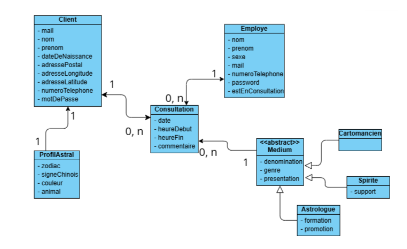

### 4.2 Lecture du modèle

D’après le schéma :

- Dans **Client** : une liste des consultations et un attribut **profil astral**.
- Dans **Employe** : une liste des consultations.
- Dans **Consultation** : le client, le médium et l’employé concernés par cette consultation.

---

## 5. IHM — maquettes

## 1. Section IHM

Cette section présente les maquettes de l'interface homme-machine (IHM) du
projet **Predict'IF**. Chaque écran est illustré par sa capture, accompagnée
d'une description fonctionnelle centrée sur l'objectif de la page.

---

### 1.1. Page d'accueil

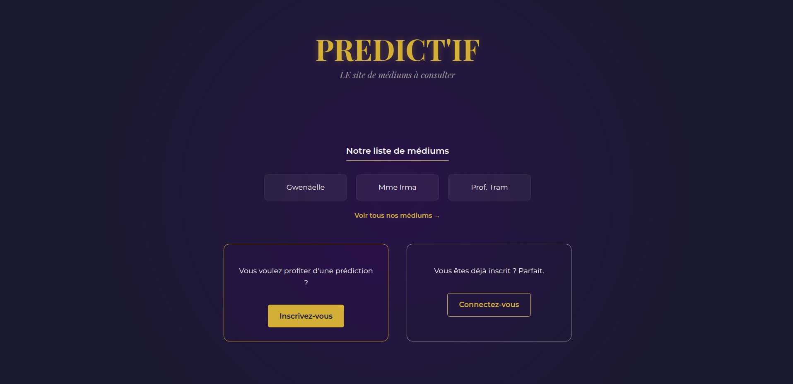

- **Public cible :** visiteur non connecté.

**Objectif fonctionnel.** Présenter le service Predict'IF (« LE site de médiums
à consulter ») et orienter le visiteur vers les deux parcours d'authentification
disponibles : inscription pour un nouvel utilisateur, connexion pour un client
existant.

---

### 1.2. Header (en-tête)

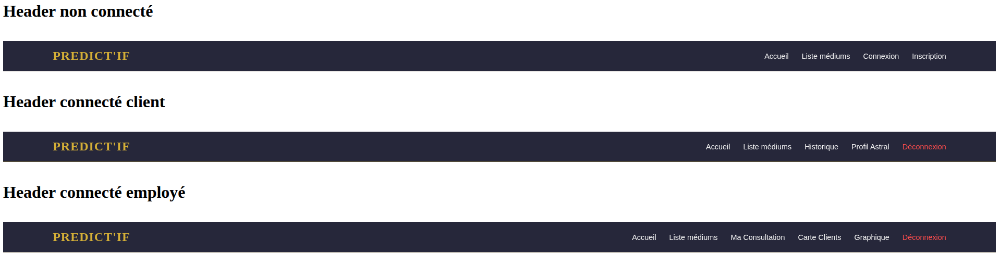

- **Public cible :** tous les utilisateurs ; rendu adapté au profil.

**Objectif fonctionnel.** Fournir la barre de navigation principale du site.
Trois variantes coexistent en fonction de l'état de session :

1. **Header non connecté** : Accueil, Liste médiums, Connexion, Inscription.
2. **Header connecté – Client** : Accueil, Liste médiums, Historique, Profil
   Astral, Déconnexion.
3. **Header connecté – Employé** : Accueil, Liste médiums, Ma Consultation,
   Carte Clients, Graphique, Déconnexion.

---

### 1.3. Footer (pied de page)

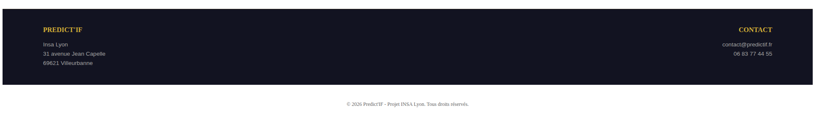

- **Public cible :** tous les utilisateurs.

**Objectif fonctionnel.** Afficher les informations institutionnelles et de
contact du service, ainsi qu'une mention légale minimaliste.

---

### 1.4. Connexion

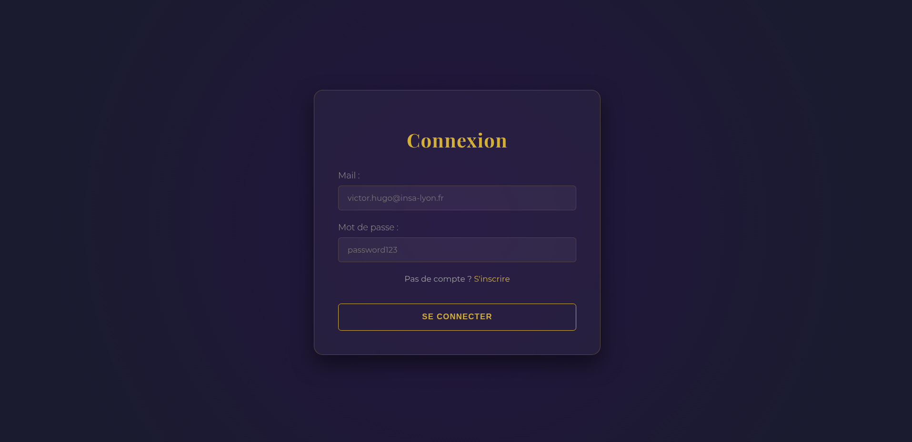

- **Public cible :** utilisateur déjà inscrit (client ou employé).

**Objectif fonctionnel.** Permettre à un utilisateur d'ouvrir une session sur
Predict'IF en saisissant ses identifiants.

---

### 1.5. Inscription

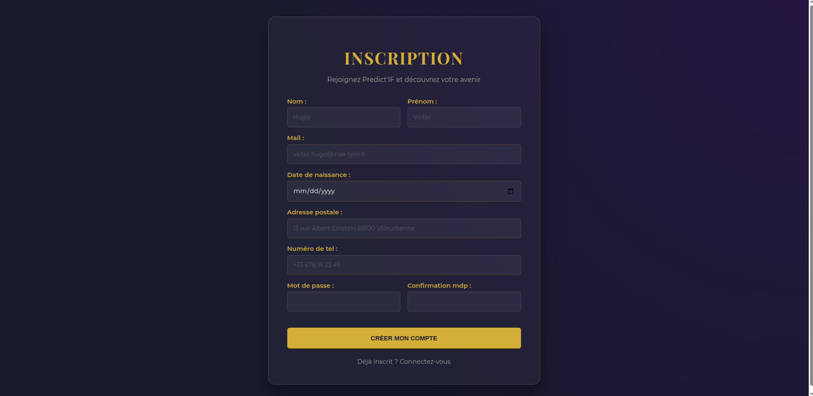

- **Public cible :** nouveau client souhaitant créer un compte.

**Objectif fonctionnel.** Collecter les informations nécessaires à la création
d'un compte client et à la génération de son profil astral (la date de
naissance étant utile pour les calculs astrologiques associés).

---

### 1.6. Liste des médiums

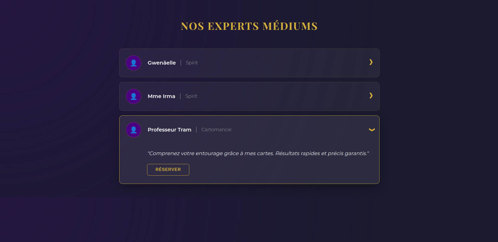

- **Public cible :** tous les utilisateurs (consultable sans connexion ; la
  réservation requiert d'être connecté).

**Objectif fonctionnel.** Présenter le catalogue des médiums proposés par
Predict'IF, en permettant à l'utilisateur de consulter le détail (description,
spécialité) et de lancer une réservation.

---

### 1.7. Mon profil astral

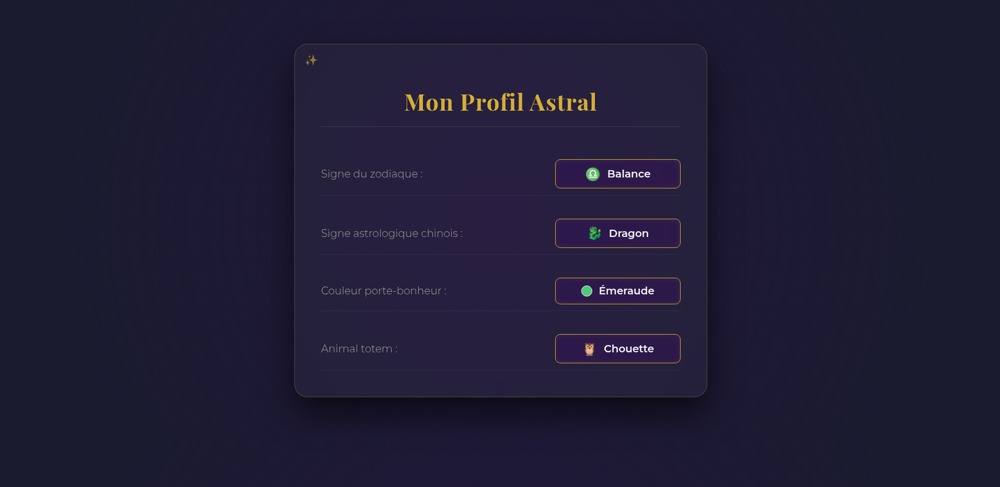

- **Public cible :** client connecté.

**Objectif fonctionnel.** Afficher au client connecté son profil astral.

---

### 1.8. Ma consultation (vue employé)

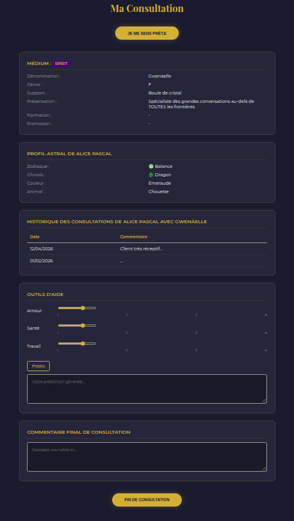

- **Public cible :** employé/médium en cours de consultation.

**Objectif fonctionnel.** Centraliser, pour l'employé qui réalise une
consultation, l'ensemble des informations nécessaires à son déroulement
(profil du médium, profil astral du client, historique) et lui fournir des
outils d'aide à la prédiction ainsi qu'un espace de saisie de commentaire
final.

---

### 1.9. Historique des consultations d'un client

- **Public cible :** employé ou client consultant l'historique d'un client donné.

**Objectif fonctionnel.** Restituer la liste des consultations passées d'un
client, avec des filtres pour faciliter la recherche. Les commentaires laissés
par les employés sont visibles uniquement par les employés ; ils ne sont pas
visibles par le client.

---

### 1.10. Carte des clients

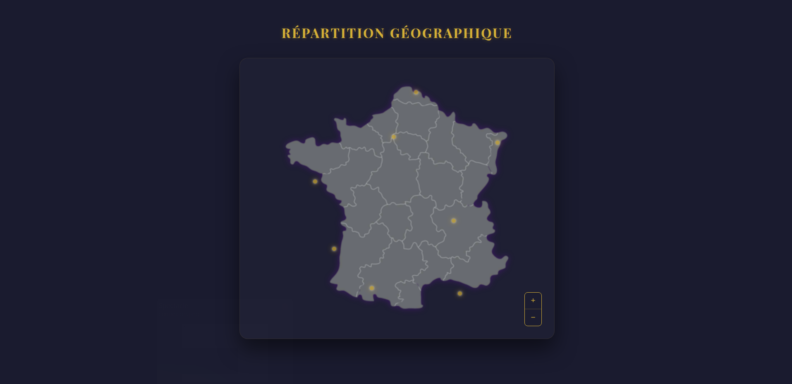

- **Public cible :** employé (analyse de la répartition géographique).

**Objectif fonctionnel.** Visualiser sur une carte de France la répartition
géographique des clients, avec, pour chaque ville, le nombre de clients
recensés.

---

### 1.11. Dashboard – Activité de l'agence

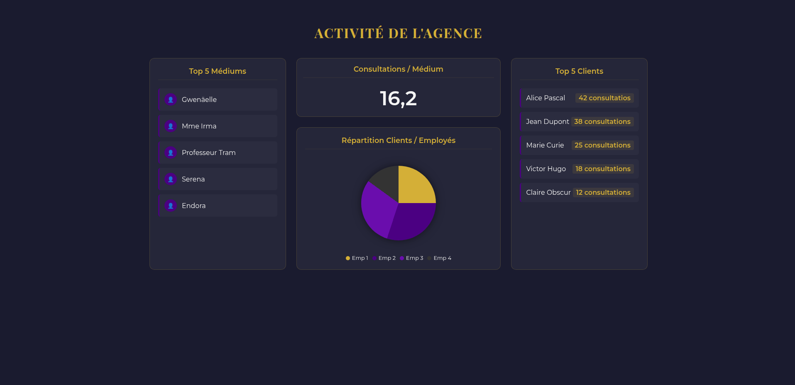

- **Public cible :** employé / responsable d'agence.

**Objectif fonctionnel.** Offrir une vue synthétique de l'activité de
l'agence Predict'IF : médiums les plus actifs, indicateurs de consultation et
clients les plus engagés.

---

## 6. IHM — tableaux ICARS

## 2. Section ICARS

Cette section regroupe les schémas **ICARS** (Intention / Contrôle /
Action·Évt / Réponse) des fenêtres significatives de Predict'IF.

Lorsqu'un comportement de fenêtre s'organise en plusieurs **modes**
(création, consultation, modification…), ces modes sont décrits à part dans
une sous-section dédiée à la fenêtre.

---

### 2.1. Fenêtre Connexion

| Intention      | Contrôle              | Action/Evt | Réponse |
| -------------- | --------------------- | ---------- | ------- |
| **INITIALISATION** |                   |            | Affichage de la fenêtre Connexion en mode saisie : champs **Mail** et **Mot de passe** vides et modifiables, bouton **Se connecter** activé. |
| Aller à l'inscription | Lien : S'inscrire | Clic       | Fermeture de la fenêtre Connexion → ouverture de la fenêtre Inscription. |
| Se connecter   | Bouton : Se connecter | Clic       | Si les champs sont renseignés alors   → Service `authentifierClient(mail, password)` / `authentifierEmploye(mail, password)`   → Si authentification OK alors : ouverture de l'accueil correspondant au profil (Client ou Employé) et mise en place de la session   → Sinon : affichage d'un message d'erreur (« identifiants invalides »). |

---

### 2.2. Fenêtre Inscription

| Intention            | Contrôle                  | Action/Evt | Réponse |
| -------------------- | ------------------------- | ---------- | ------- |
| **INITIALISATION**   |                           |            | Affichage de la fenêtre Inscription en **mode création** : champs vides et modifiables. Bouton **Créer mon compte** activé. |
| Aller à la connexion | Lien : Connectez-vous     | Clic       | Fermeture de la fenêtre Inscription → ouverture de la fenêtre Connexion. |
| Créer le compte      | Bouton : Créer mon compte | Clic       | Si tous les champs obligatoires sont renseignés et `MotDePasse == ConfirmationMotDePasse` alors   → Service `inscrireClient(...)`   → Si Inscrire OK alors : passage en **mode consultation** (ou redirection Connexion)   → Sinon : gestion d'erreur. |

#### Modes de la fenêtre Inscription

##### Mode création

- Tous les champs (hors identifiant interne) sont vides et modifiables.
- Le bouton **Créer mon compte** est activé.

---

### 2.3. Fenêtre Liste des médiums

| Intention              | Contrôle               | Action/Evt | Réponse |
| ---------------------- | ---------------------- | ---------- | ------- |
| **INITIALISATION**     |                        |            | → Service `getAllMedium()`   Affichage de la liste des médiums repliée par défaut. |
| Voir le détail médium  | Bandeau médium         | Clic       | Dépliage / repliage de la fiche du médium ciblé. |
| Réserver une consultation | Bouton : Réserver  | Clic       | Si Client connecté alors   → Service `demanderConsultation(idClient, idMedium)`   → Si OK : confirmation et bascule vers le suivi de consultation   → Sinon : gestion d'erreur. |

---

### 2.4. Fenêtre Mon profil astral

| Intention          | Contrôle | Action/Evt | Réponse |
| ------------------ | -------- | ---------- | ------- |
| **INITIALISATION** |          |            | Récupération du **client connecté** et affichage des attributs du profil astral déjà présents sur le client. |

---

### 2.5. Fenêtre Ma consultation (vue employé)

| Intention                | Contrôle                        | Action/Evt | Réponse |
| ------------------------ | ------------------------------- | ---------- | ------- |
| **INITIALISATION**       |                                 |            | → Service `getConsultationActuelle(idEmploye)` puis récupération des objets liés   Historique : `getConsultationsClientMedium(idClient, idMedium)`   Affichage en **mode préparation**. |
| Démarrer la consultation | Bouton : Je me sens prêt.e      | Clic       | Passage en **mode consultation active**. |
| Générer une prédiction   | Bouton : Prédire                | Clic       | → Service `getPredictionEnCasPanneInspiration(idClient, amour, sante, travail)`   Affichage du texte généré. |
| Terminer la consultation | Bouton : Fin de consultation    | Clic       | → Service `finirConsultation(idEmploye, consultation, commentaire)`   Si OK : passage en **mode clôturé**. |

---

### 2.6. Fenêtre Historique des consultations d'un client

| Intention             | Contrôle                  | Action/Evt | Réponse |
| --------------------- | ------------------------- | ---------- | ------- |
| **INITIALISATION**    |                           |            | → Service `getConsultationsClientMedium(idClient, idMedium)`   Affichage de la liste des consultations et filtres vides. |
| Filtrer par date      | Champ : Date              | Sélection  | Mise à jour de la liste selon la date sélectionnée. |
| Filtrer par médium    | Liste : Médium            | Sélection  | Mise à jour de la liste selon le médium sélectionné. |
| Afficher un commentaire | Bandeau d'une consultation | Clic     | Si commentaire : dépliage du bloc commentaire. Sinon : aucune action. |

---

### 2.7. Fenêtre Carte des clients

| Intention          | Contrôle                | Action/Evt | Réponse |
| ------------------ | ----------------------- | ---------- | ------- |
| **INITIALISATION** |                         |            | → Service `getAllClients()` / `getTousClients()` *(noms à harmoniser)*   Affichage de la carte et positionnement selon les coordonnées des clients. |
| Voir le détail d'une ville | Point client (ville) | Survol    | Affichage d'une info-bulle « Ville : N clients ». |

---

### 2.8. Fenêtre Dashboard – Activité de l'agence

| Intention          | Contrôle | Action/Evt | Réponse |
| ------------------ | -------- | ---------- | ------- |
| **INITIALISATION** |          |            | → Services `getTop5Medium()`, `getNbConsultationMoyenneParMedium()`, `getNbConsultationParEmploye()`, `getTop5Client()`   Affichage des indicateurs en lecture seule. |

---

## 7. Spécification des services

### 7.1 `inscrireClient(...)`

`public Boolean inscrireClient(String mail, String nom, String prenom, LocalDate dateDeNaissance, String adressePostal, String numeroTelephone, String motDePasse)`

**Description.** Ce service crée un client en complétant avec son profil astral
(appel au sous service `calculProfilAstral(Client client)` qui fait appel à l’API
IfAstroNet) correspondant et la traduction en coordonnées géographiques de son
adresse postale (appel au sous service `mettreCoordonneeClient(Client client)` et
l’API `adresse.data.gouv.fr`) et le rend pérenne. Il renvoie `true` si ce nouveau
client a été inscrit et `false` si l’inscription n’a pu se réaliser ou si le client
existait déjà.

**Algo (fourni).**

- Compléter les informations manquantes
- Vérifier si le client existe déjà dans la base
- S’il n’existe pas : le rendre pérenne

### 7.2 `authentifierClient(mail, password)`

`public Client authentifierClient(String mail, String password)`

**Description.** Récupère le client correspondant au mail et password donnés en
paramètre et le renvoie.

### 7.3 `authentifierEmploye(mail, password)`

`public Employe authentifierEmploye(String mail, String password)`

**Description.** Récupère l’employé correspondant au mail et password donnés en
paramètre et le renvoie.

### 7.4 `getMediumById(id)`

`public Medium getMediumById(Long id)`

**Description.** Renvoie le médium auquel l’id en paramètre correspond.

### 7.5 `getAllMedium()`

`public List<Medium> getAllMedium()`

**Description.** Renvoie la liste de tous les médiums.

### 7.6 `getConsultationActuelle(idEmploye)`

`public Consultation getConsultationActuelle(Long idEmploye)`

**Description.** Récupère la consultation de l’employé qui n’est pas encore finie
(dont l’heure de fin est `null`).

### 7.7 `demanderConsultation(idClient, idMedium)`

`public Boolean demanderConsultation(Long idClient, Long idMedium)`

**Description.** Attribue la consultation à un employé libre et dont le sexe
correspond au genre du médium. Renvoie `true` si un employé a pu être attribué et
`false` sinon.

**Algo (fourni).**

- Récupère le client et le médium correspondant aux ids
- Crée une consultation avec le client et le médium
- Cherche un employé libre et le met dans la consultation
- Essaye d’ajouter la consultation à l’employé et au client
- Rend tout le monde pérenne
- Si une des opérations ci-dessus échoue (par exemple : pas d’employé libre) : renvoie `false`

### 7.8 `getConsultationsClientMedium(idClient, idMedium)`

`public List<Consultation> getConsultationsClientMedium(Long idClient, Long idMedium)`

**Description.** Renvoie les consultations du client filtrées par le médium.

### 7.9 `getAllClients()`

`public List<Client> getAllClients()`

**Description.** Renvoie la liste de tous les clients.

### 7.10 `seMettrePret(idEmploye, consultation)`

`public Boolean seMettrePret(Long idEmploye, Consultation consultation)`

**Description.** Permet à l’employé d’indiquer qu’il est prêt (ce qui envoie
alors son numéro de téléphone au client). Ce service met aussi l’heure de début de
la consultation égale à l’heure actuelle.

### 7.11 `getPredictionEnCasPanneInspiration(idClient, amour, sante, travail)`

`public String getPredictionEnCasPanneInspiration(Long idClient, int amour, int sante, int travail)`

**Description.** Donne une prédiction amour, santé et travail appropriée pour ce
client.

**Algo (fourni).**

- Appel à l’API IfAstroNet avec les infos du client et les niveaux d’amour, de santé et de travail

### 7.12 `finirConsultation(idEmploye, consultation, commentaire)`

`public Boolean finirConsultation(Long idEmploye, Consultation consultation, String commentaire)`

**Description.** Met à jour la consultation avec le commentaire, l’heure de fin et
met l’attribut `estEnConsultation` de l’employé à `false` pour indiquer qu’il est
disponible.

### 7.13 Statistiques

#### `getTop5Medium()`

`public List<Medium> getTop5Medium()`

**Description.** Donne les 5 meilleurs médiums (ceux qui ont le plus de
consultations) dans l’ordre décroissant.

**Algo (fourni).**

- Calcule le nombre de consultations par médium puis les trie en ordre décroissant et ne renvoie que les 5 premiers

#### `getNbConsultationMoyenneParMedium()`

`public Double getNbConsultationMoyenneParMedium()`

**Description.** Calcule la moyenne du nombre de consultations des médiums.

**Algo (fourni).**

- Calcule le nombre de consultations par médium puis fait la moyenne

#### `getTop5Client()`

`public List<Client> getTop5Client()`

**Description.** Donne les 5 clients les plus assidus (ceux qui ont le plus de
consultations) dans l’ordre décroissant.

#### `getNbConsultationParEmploye()`

`public Map<Employe, Integer> getNbConsultationParEmploye()`

**Description.** Donne le nombre de consultations par employé (pour chaque employé
c’est égal à la longueur de sa liste de consultations).

